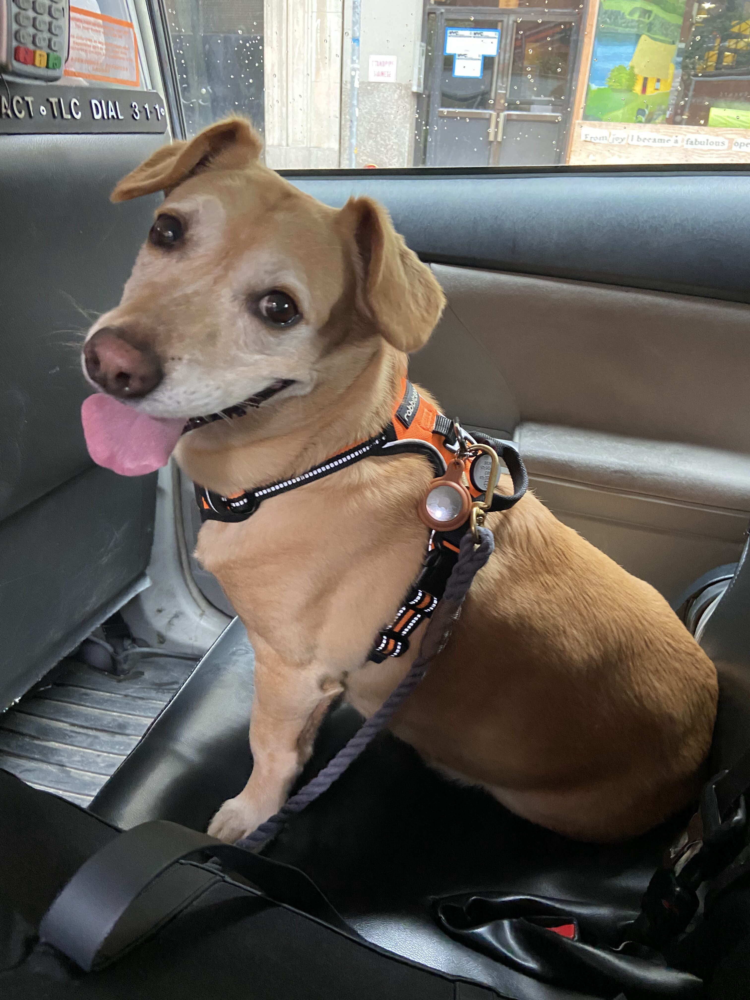

# Dog image classification example

### Overview
This repository contain notebook with full analysis and machine learning process for dog image classification.
We create model that is able to classify if dog is present on image.

sample images:

### Run
install requirements:
`pip install -r requirements`
Open jupyter notebook "image_classification_road_sign.ipynb" and run all cells.

### Adjust
If you want to create model  for different image dataset, replace images in data_image/images folder.
Then adjust "data_images/output.manifest.json" file which contain all train set images paths and their labels.

### AWS Ground truth
Dataset for training is prepared based on AWS Academy activity in course "AWS Data Engineering".
This notebook is continuation af machine learning process started in activity "Processing Data for ML Activity: Labeling with SageMaker Ground Truth".
In course activity AWS SageMaker Ground Trouth service is used to label images containing dog, cats and other animals and objects.
Notebook presents how to train image classifier using AWS labeling task output.
more information on AWS SageMaker Ground Truth: https://aws.amazon.com/sagemaker/groundtruth/
more information on AWS Academy Data Engineering course: https://aws.amazon.com/training/awsacademy/

### Used libraries:
tensorflow and kreas - for creating model convolutional neural network 
matplotlip - data visualisation
opencv - image preparation and augmentation (creating larger training set by modifying existing images, this technique also help with model generalization)
numy and pandas - for data preparation and analysis

### Neural network architecture design
 Used CNN architecture introduced by Nvidia team and described in this article:
https://developer.nvidia.com/blog/deep-learning-self-driving-cars/

